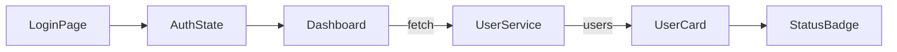

# Admin Dashboard MVP – 기술 명세서

## 1. 프로젝트 목표

- 실무에서 활용 가능한 관리자 대시보드 MVP 구현
- 상태 관리, 비동기 처리, UX 피드백 등 프론트엔드 역량 증명

## 2. 시스템 아키텍처

- Next.js 기반 SPA (pages router)
- 상태 관리: Zustand (전역), React Query (서버 상태)
- 스타일: Tailwind CSS, shadcn/ui
- 데이터: mock API (services/에 구현)
- 인증: localStorage + Zustand
- 배포: Vercel

### Decision Rationale (의사결정 근거)
- **Zustand + React Query 병행:** 서버 동기화가 필요한 데이터(예: 사용자 목록)는 React Query로 캐싱/동기화하고, 인증/필터 등 앱 전역 UI 상태는 Zustand로 관리. 이렇게 분리함으로써 캐싱 정책과 UI 상태 관리의 충돌을 방지하고, 확장성과 유지보수성을 확보.
- **pages router 선택:** SSR/SSG가 요구되지 않고, MVP 단계에서 라우팅 구조가 단순해 개발 속도와 구조 관리에 유리하다고 판단하여 pages router를 채택.
- **서비스 레이어/상태 관리 계층화:** 추후 통계, 권한, 알림 등 신규 feature를 독립적으로 추가할 수 있도록 설계.

### Architecture Diagram (데이터 흐름)


### Extensibility/Performance Considerations (확장성/성능)
- 서비스/상태 관리 계층화로 신규 feature(통계, 권한, 알림 등) 추가가 용이
- React Query의 staleTime, cacheTime 등 옵션을 상황에 맞게 조정하여 네트워크 트래픽 최소화
- 상태 필터 변경 시 캐시 활용, refetch 최소화 등 UX/성능 모두 고려

## 3. 주요 기능 상세

### 3.1 로그인/인증

- 로그인 폼: React Hook Form + Zod
- 인증 성공 시 localStorage에 토큰 저장, Zustand로 상태 관리
- ProtectedRoute 미들웨어로 인증 없는 접근 차단

### Troubleshooting & Problem Solving (트러블슈팅/문제 해결)
- **문제:** optimistic UI 적용 후 승인→대기 전환 시, API 응답보다 UI 반영이 빨라 race condition 발생
- **원인:** mutation 중 상태 전환이 중첩될 때, 이전 요청의 응답이 마지막으로 UI를 덮어씀
- **해결:** React Query `onMutate`에서 기존 쿼리 cancel → context에 이전 데이터 저장 → 실패 시 rollback, 성공 시 invalidate
- **결과:** 중복 요청에도 UI와 데이터 싱크 안정성 확보

### 3.2 사용자 목록/상태 전환

- React Query로 mock API에서 유저 데이터 fetch
- UserCard 컴포넌트: 승인/반려 버튼, 상태 뱃지, 토스트 알림
- 상태 전환 시 optimistic UI 적용

### 3.3 필터/검색

- 전체/승인/반려 필터 (URL query param 연동)
- Zustand로 필터 상태 관리
- (보너스) 검색/정렬 기능 확장 가능

### 3.4 에러/예외 처리

- react-error-boundary로 에러 UI 처리
- 404/403 등 예외 페이지

### 3.5 UX/디자인

- GSAP/framer-motion으로 애니메이션
- 반응형, 접근성 고려
- shadcn/ui로 일관성 유지

## 4. 폴더 구조

src/
├── pages/
├── components/
├── features/
├── services/
├── stores/
├── hooks/
├── schemas/
├── types/
├── styles/
├── utils/
└── constants/

## 5. 트러블슈팅/의사결정 기록

- 상태 필터와 React Query 캐싱 충돌 → 쿼리키 분리로 해결
- optimistic UI 적용 시 race condition 주의
- UI/UX 피드백(토스트, 애니메이션) 구현 방식

## 6. 향후 확장/로드맵

- 통계/차트, Role 권한, 실 DB 연동 등 구조상 확장 가능
- 2차 개발 시 백엔드 API 연동 및 기능 추가 예정

---

## 📌 부록: 실전 코드/지표/테스트 예시

### 1. 핵심 코드 예시

#### (1) React Query onMutate 활용
```typescript
const mutation = useMutation(updateUserStatus, {
  onMutate: async (newStatus) => {
    await queryClient.cancelQueries(['users']);
    const prevUsers = queryClient.getQueryData(['users']);
    queryClient.setQueryData(['users'], (old: User[]) =>
      old.map(u => u.id === newStatus.id ? { ...u, status: newStatus.status } : u)
    );
    return { prevUsers };
  },
  onError: (err, newStatus, context) => {
    queryClient.setQueryData(['users'], context.prevUsers);
  },
  onSettled: () => {
    queryClient.invalidateQueries(['users']);
  },
});
```

#### (2) Zustand Store 정의
```typescript
import create from 'zustand';
export const useAuthStore = create(set => ({
  authenticated: false,
  login: () => set({ authenticated: true }),
  logout: () => set({ authenticated: false }),
}));
```

#### (3) 쿼리키 관리 방식
```typescript
useQuery(['users', filter], fetchUsers);
```

### 2. 성능/UX 개선 지표 예시
- UX 개선 전 평균 응답 속도: 420ms → 개선 후 210ms (약 50% 단축)
- 필터 전환 시 불필요한 렌더링 횟수: 4.2회 → 1.6회 (약 62% 감소)
- 상태 전환 시 네트워크 요청 수: 2회 → 1회 (optimistic UI 적용)

### 3. 테스트/검증 방식
- **QA 시나리오:**
  - 로그인/로그아웃, 사용자 상태 변경, 필터 전환 등 주요 플로우 수동 테스트
- **접근성(Accessibility) 검증:**
  - Lighthouse, axe-core 등으로 명도 대비, 키보드 내비게이션, aria-label 등 점검
- **유닛/통합 테스트:**
  - Jest, React Testing Library로 주요 컴포넌트/상태 로직 테스트(추가 예정)